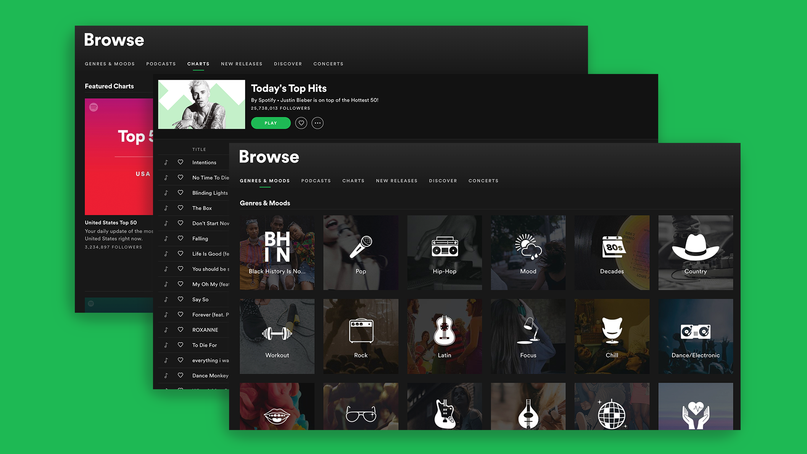

# Predicting Spotify Track Skips

_by Austin Poor_

This is the code for my third project for the [Metis Data Science Bootcamp](https://www.thisismetis.com/data-science-bootcamps). We each chose our own topics but were required to use PostgreSQL to store our data and classification to model our data.

For my project, I chose to work on a slightly simplified version of the [Spotify Sequential Skip Prediction Challenge](https://www.aicrowd.com/challenges/spotify-sequential-skip-prediction-challenge). The goal of the project was to use data supplied by Spotify, with information on anonamyzed user listening sessions, to predict whether or not a user would skip a given song in a sequence.

You can find the blog post I wrote about the project [here](https://towardsdatascience.com/predicting-spotify-track-skips-49cf4a48b2a5).

***

***

The link to the original challenge is [here](https://www.aicrowd.com/challenges/spotify-sequential-skip-prediction-challenge).

\[1] B. Brost, R. Mehrotra, and T. Jehan, The Music Streaming Sessions Dataset (2019), Proceedings of the 2019 Web Conference
